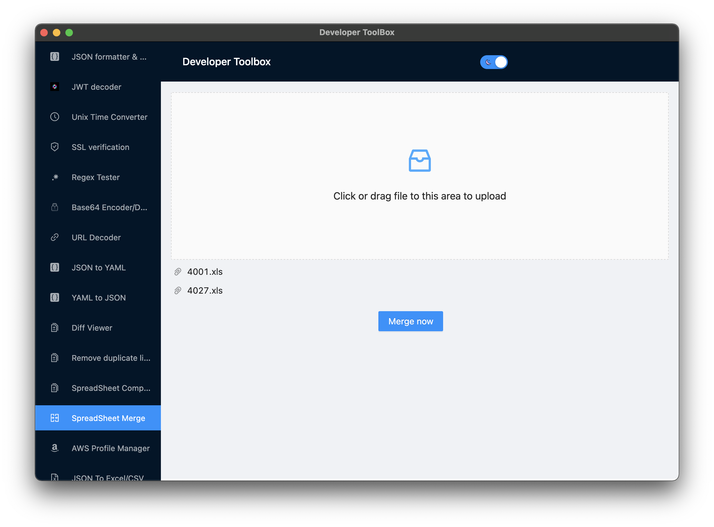

## Developer ToolBox

&nbsp;
&nbsp;
&nbsp;
&nbsp;
&nbsp;

A Must Necessary Developer App.

## Features

- JSON formatter & Validator
- JWT decoder
- Unix Time Converter
- SSL Information
- Base64 Decoder/Encoder
- URL Decoder
- JSON to YAML
- YAML to JSON
- Diff viewer
- Remove duplicate lines
- SpreadSheet Comparison
- AWS Profile Manager
- JSON to Excel/CSV
- Status Tracker
- [Request a Feature](https://github.com/AndresMorelos/devapp/issues/new)

## Translations:

- Spanish: ✅
- English: ✅
- [Contribute](https://github.com/AndresMorelos/developer-toolbox/wiki/How-to-contribute-to-translations)

## AutoUpdates:

- Win: ✅
- Linux: ✅
- Mac: ✅ (I still need to buy the developer certificate)

## Releases

[https://github.com/AndresMorelos/developer-toolbox/releases](https://github.com/AndresMorelos/developer-toolbox/releases)

## Icon

Thanks to [Wish Forge](http://wishforge.games/) to leave me to use its icon as the app icon.
